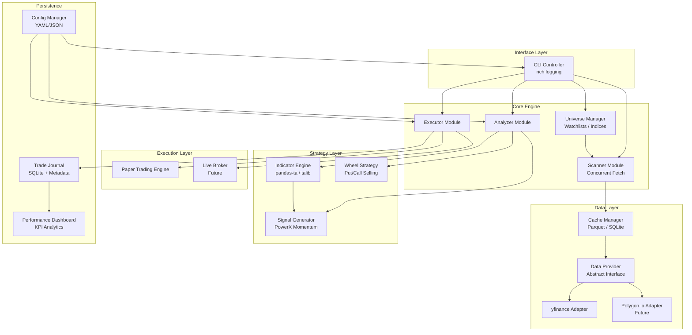
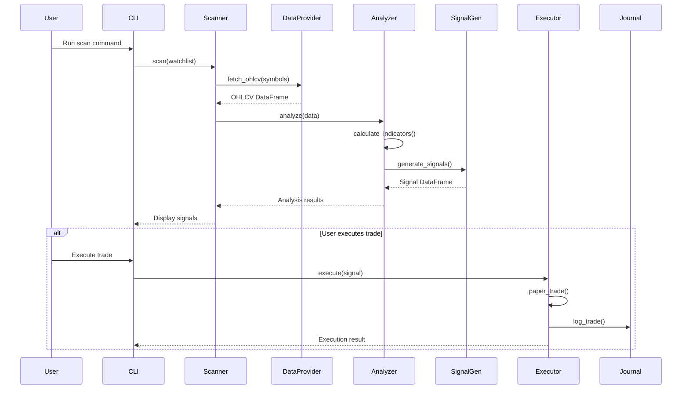

# Financial Fortress - System Architecture

> PowerX Optimizer Implementation | Python 3.12+ | Modular Trading System
>
> *Inspired by "Building Your Financial Fortress" — Scanner, Analyzer, Performance Tracking*

---

## High-Level Architecture



---

## Module Responsibilities

### 1. Interface Layer

| Module | File | Responsibility |
|--------|------|----------------|
| **CLI Controller** | `cli/main.py` | Entry point, command parsing, user interaction |
| **Logger** | `cli/logger.py` | Rich console output, structured logging |

### 2. Data Layer

| Module | File | Responsibility |
|--------|------|----------------|
| **CacheManager** | `data/cache.py` | TTL-based caching with Parquet storage |
| **DataProvider (ABC)** | `data/provider.py` | Abstract base class defining data source contract |
| **YFinanceProvider** | `data/yfinance_provider.py` | yfinance implementation |
| **PolygonProvider** | `data/polygon_provider.py` | Future: Polygon.io implementation |

**Cache Strategy:**
- Check cache before API call
- TTL configurable per interval (e.g., daily data = 4 hours)
- Store as Parquet files: `cache/{symbol}_{interval}.parquet`
- Invalidate stale entries on startup

**Data Contract:**
```python
# Abstract method signature
def fetch_ohlcv(symbol: str, start: date, end: date, interval: str) -> pd.DataFrame
```

### 2.5. Universe Layer

| Module | File | Responsibility |
|--------|------|----------------|
| **UniverseManager** | `universe/manager.py` | Load/manage ticker universes |
| **Presets** | `universe/presets.py` | Built-in universes (S&P 500, custom) |

**Universe Sources:**
- **Preset**: `sp500`, `nasdaq100`, `dow30`
- **Custom**: User-defined YAML/CSV watchlists
- **Dynamic**: Filter by sector, market cap (future)

### 3. Analysis Layer

| Module | File | Responsibility |
|--------|------|----------------|
| **IndicatorEngine** | `analysis/indicators.py` | RSI, Stochastics, MACD vectorized calculation |
| **SignalGenerator** | `analysis/signals.py` | PowerX buy/sell signal rules |

**PowerX Signal Logic (Momentum):**

| Signal | Condition |
|--------|-----------|
| **BUY** | RSI(7) > 50 AND Stoch(14,3,3) > 50 AND MACD > Signal |
| **SELL (Short)** | RSI(7) < 50 AND Stoch(14,3,3) < 50 AND MACD < Signal |
| **NEUTRAL** | Any condition not met |

### 3.5. Wheel Strategy Layer (Options)

| Module | File | Responsibility |
|--------|------|----------------|
| **WheelStrategy** | `strategy/wheel.py` | Put/call selling logic |
| **OptionsAnalyzer** | `strategy/options_analyzer.py` | ROI calculator, strike selection |

**Wheel Strategy Rules** (per PDF):

| Phase | Rule |
|-------|------|
| **Sell Puts** | Target 30%+ annualized ROI at strike you'd buy |
| **Expiration** | Mon/Tue: this week; Wed: both; Thu/Fri: next week |
| **If Assigned** | Sell calls at or above assigned price, 30%+ ROI |
| **Exit at 80%** | Close within 24hrs if 80% of max profit achieved |
| **Exit at 90%** | Close before expiration if 90% profit reachable |

**Options Data Contract:**
```python
# Additional DataProvider method for options
def fetch_options_chain(symbol: str, expiration: date) -> pd.DataFrame
# Returns: strike, type, bid, ask, volume, open_interest, implied_vol
```

### 4. Execution Layer

| Module | File | Responsibility |
|--------|------|----------------|
| **ExecutorBase (ABC)** | `execution/executor.py` | Abstract execution interface |
| **PaperTrader** | `execution/paper_trader.py` | Simulated order execution with P&L tracking |
| **PositionManager** | `execution/positions.py` | Track open positions, calculate stops/targets |

### 5. Configuration & Persistence

| Module | File | Responsibility |
|--------|------|----------------|
| **ConfigManager** | `config/settings.py` | Load/validate YAML config |
| **TradeJournal** | `persistence/journal.py` | Log trades with metadata |
| **PerformanceDashboard** | `persistence/dashboard.py` | KPI calculations and analytics |

**Trade Journal Fields** (per PowerX Optimizer):
| Field | Type | Description |
|-------|------|-------------|
| `timestamp` | datetime | Trade entry/exit time |
| `symbol` | str | Ticker symbol |
| `action` | enum | BUY / SELL / CLOSE |
| `price` | float | Execution price |
| `quantity` | int | Number of shares |
| `pnl` | float | Realized profit/loss |
| `according_to_plan` | bool | Was trade per trading plan? |
| `confidence_level` | int | 1-5 confidence rating |
| `notes` | str | Optional trade notes |

**Performance KPIs** (Rapid Performance Analyzer):
| KPI | Description |
|-----|-------------|
| Win Rate | % of profitable trades |
| Profit Factor | Gross profit / Gross loss |
| Avg Win / Avg Loss | Risk/reward profile |
| Average Trade Length | Days in trade |
| Longest Trade | Max holding period |
| Realized P&L | Cumulative and by month |
| Fees & Commissions | Cost tracking |
| Trades by Day | Distribution analysis |

---

## Directory Structure

```
FinanceX/
├── cli/
│   ├── __init__.py
│   ├── main.py              # Entry point, argparse/click
│   └── logger.py            # Rich logging setup
├── data/
│   ├── __init__.py
│   ├── cache.py             # TTL-based Parquet cache
│   ├── provider.py          # ABC DataProvider
│   └── yfinance_provider.py # yfinance implementation
├── universe/
│   ├── __init__.py
│   ├── manager.py           # Universe loader
│   ├── presets.py           # SP500, NASDAQ100, etc.
│   └── watchlists/          # Custom watchlist YAMLs
│       └── default.yaml
├── scanner/
│   ├── __init__.py
│   └── scanner.py           # Concurrent ticker scanning
├── analysis/
│   ├── __init__.py
│   ├── indicators.py        # Indicator calculations
│   └── signals.py           # Signal generation (momentum)
├── strategy/
│   ├── __init__.py
│   ├── wheel.py             # Wheel Strategy (put/call selling)
│   └── options_analyzer.py  # ROI calculator, strike selection
├── execution/
│   ├── __init__.py
│   ├── executor.py          # ABC Executor
│   ├── paper_trader.py      # Paper trading engine
│   └── positions.py         # Position management
├── config/
│   ├── __init__.py
│   ├── settings.py          # Config loader
│   └── default.yaml         # Default configuration
├── persistence/
│   ├── __init__.py
│   ├── journal.py           # Trade logging with metadata
│   └── dashboard.py         # KPI analytics (Rapid Performance Analyzer)
├── cache/                   # Auto-created cache directory
│   └── .gitkeep
├── tests/
│   ├── __init__.py
│   ├── test_indicators.py
│   ├── test_signals.py
│   ├── test_cache.py
│   └── test_paper_trader.py
├── config.yaml              # User configuration
├── requirements.txt
├── ARCHITECTURE.md
└── README.md
```

---

## Data Flow Diagram



---

## Configuration Schema

```yaml
# config.yaml
strategy:
  name: "PowerX"
  indicators:
    rsi:
      period: 7
      overbought: 50  # For signal, not traditional 70/30
      oversold: 50
    stochastics:
      k_period: 14
      d_period: 3
      smooth_k: 3
    macd:
      fast: 12
      slow: 26
      signal: 9

risk_management:
  stop_loss_percent: 2.0
  profit_target_percent: 6.0
  max_position_size: 1000
  max_open_positions: 5

data:
  provider: "yfinance"  # or "polygon"
  default_interval: "1d"
  lookback_days: 60

cache:
  enabled: true
  directory: "cache/"
  ttl_minutes:
    1d: 240    # 4 hours for daily data
    1h: 30     # 30 min for hourly
    5m: 5      # 5 min for 5-minute bars

universe:
  default: "custom"       # or "sp500", "nasdaq100"
  custom_watchlist: "universe/watchlists/default.yaml"

scanner:
  max_concurrent: 10      # Parallel fetch limit
  batch_delay_ms: 100     # Delay between batches

paper_trading:
  initial_capital: 100000
  commission_per_trade: 0.0

logging:
  level: "INFO"
  file: "logs/trading.log"
```

---

## Extension Points

| Component | Extension Method |
|-----------|------------------|
| **Data Providers** | Implement `DataProvider` ABC |
| **Execution Brokers** | Implement `ExecutorBase` ABC |
| **Strategies** | New signal generators following interface |
| **Indicators** | Add to `IndicatorEngine` registry |

---

## Technology Stack Summary

| Component | Technology | Purpose |
|-----------|------------|---------|
| Runtime | Python 3.12+ | Modern Python features |
| Data Fetch | yfinance | Market data |
| Analysis | pandas-ta / TA-Lib | Indicator calculation |
| DataFrames | pandas | Data manipulation |
| CLI | click + rich | Interface & logging |
| Config | PyYAML | Configuration management |
| Testing | pytest | Unit & integration tests |
